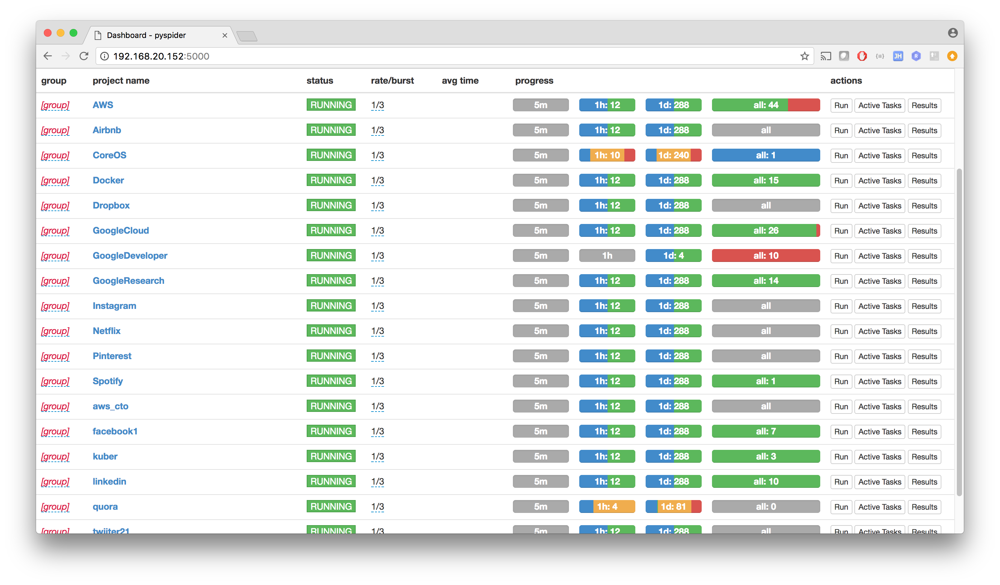

## www.architall.com ##

Check it out: [www.architall.com](http://www.architall.com/)

### spider: ###

Use [pyspider](http://docs.pyspider.org/en/latest/) as crawler.

Import dump/projectdb into your mongodb. It contains crawler code for most of the popular tech blogs, such as Google/Facebook/Linkedin/Twitter/Uber/AWS/Spotify/Pinterest/Docker/Kubernetes.

### ghost ###

Pyspider will post the crawled updates automatically into your blog site backed by [https://ghost.org/].

